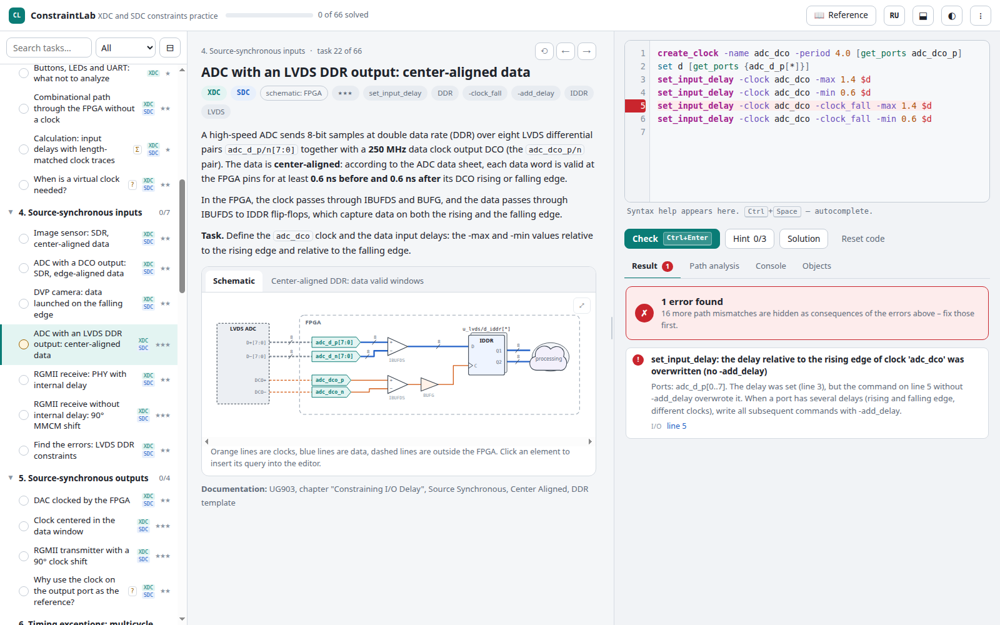

# ConstraintLab

**Interactive practice for timing and physical design constraints: Vivado XDC and SDC for ASIC tools.**

Every task is a real interface or a block of a system-on-chip with a schematic and timing diagrams.
You write the constraints, and ConstraintLab checks them **by meaning**: it runs them as a Tcl script,
builds a model of clocks and timing paths and compares the resulting setup and hold requirements with
a reference solution. Any equivalent form is accepted (variables, `expr`, a different option order,
`-to [get_cells …]` instead of `-to [get_pins …/D]`), and error messages point to the root cause.

**Try it online: https://shchuchkin-pkims.github.io/ConstraintLab/** · [Русская версия](README.ru.md)



## Features

- **66 tasks in 12 modules**, from a single `create_clock` to DDR interfaces, clock domain crossings,
  multicycle paths, ASIC scan modes, clock gating, on-chip variation and MMMC.
- **Every task** has a realistic scenario, a schematic (click an element to insert its `get_ports` /
  `get_cells` query), timing diagrams, step-by-step hints and a detailed explanation: why the constraint
  is needed, what goes wrong with typical mistakes and how to verify the result in Vivado or PrimeTime.
- **Checking by meaning.** A built-in mini static timing analyzer handles primary, generated and virtual
  clocks, clock propagation, edge relationships, I/O delays (including `-clock_fall` and `-add_delay`),
  false paths, multicycle paths (`-setup`/`-hold`, `-start`/`-end`), `set_max_delay -datapath_only`,
  clock groups and exception priorities. Mistakes are reported with explanations: a frequency written
  instead of a period, a clock defined at the wrong point, a missing `-add_delay`, a wrong `-min` sign,
  a multicycle path without its `-hold` pair, and many more.
- **XDC and SDC tags** show where a solution applies: only in Vivado, only in ASIC tools, or in both when
  the syntax is common. The explanation says what differs between XDC and SDC in that task.
- **Tcl console** with `report_clocks`, `report_clock_interaction`, `check_timing`, `report_timing`,
  `report_exceptions` and object queries (`-hierarchical`, `-filter`, `-of_objects`).
- **Path analysis** tab: the requirement of every timing path under your constraints, compared with the
  reference, with launch and capture edge diagrams.
- **Command reference** with options and examples, and overview articles.
- **English and Russian** interface (EN/RU button at the top).
- **Works offline** in any modern browser (Chrome, Edge, Firefox) on Windows, Linux and macOS, with no
  installation and no dependencies. Can be built into a single HTML file.
- **Extensible task bank**: add your own tasks as JavaScript files or with the built-in author mode.

## Quick start

- Open `index.html` in a browser (double-click is enough).
- Or run `./run.sh` (Linux, macOS) or `run.bat` (Windows) to open ConstraintLab in a separate app window.
- Single-file version: `python3 tools/build.py` creates `dist/constraintlab.html` with everything inside.
- Online: https://shchuchkin-pkims.github.io/ConstraintLab/ (GitHub Pages, served from the repository root).

Progress, your answers and settings are stored in the browser (localStorage); the ⋮ menu saves progress
to a file and loads it on another computer.

## Learning path

Modules 1–9 are built around an FPGA (Vivado), modules 10–12 around ASIC tools.
Inside a module the difficulty grows (★ – ★★★).

| # | Module | What it teaches |
|---|---|---|
| 1 | Clocks: the basics | `create_clock`, waveform, differential inputs, asynchronous clocks, clocks derived automatically by MMCM |
| 2 | Generated clocks | divider registers, BUFGMUX clock multiplexer, two frequencies on one input, edge relationships |
| 3 | System-synchronous I/O | input and output delays with board trace delays, asynchronous inputs, combinational feedthrough paths, virtual clocks |
| 4 | Source-synchronous inputs | SDR and DDR, center-aligned and edge-aligned data, data launched on the falling edge, RGMII |
| 5 | Source-synchronous outputs | forwarded clocks through ODDR, clock inversion, RGMII transmitter |
| 6 | Timing exceptions: multicycle and false paths | multicycle paths (N and N−1, `-start`/`-end`), false paths, reset synchronizer, exception priorities |
| 7 | Clock domain crossing | synchronizers, Gray code (`set_max_delay -datapath_only`, `set_bus_skew`), the XPM pitfall, related clocks |
| 8 | XDC physical constraints | package pins, I/O standards, LVDS, IOB packing, configuration, DRIVE and SLEW |
| 9 | Complete interfaces and debugging | SPI, SDR SDRAM, finding mistakes in an XDC file, reading `check_timing` |
| 10 | SDC for ASIC: block and clocks | block environment, PLL and dividers, operating modes with `set_case_analysis`, virtual clocks for block budgets, before and after CTS |
| 11 | SDC for ASIC: modes, scan, clock gating | scan shift mode, programmable divider in merged mode, ICG and `set_clock_gating_check`, `set_ideal_network`, modes and corners |
| 12 | SDC for ASIC: hierarchy and sign-off | block budgets with `set_clock_latency -source`, design rules, skew, OCV and CRPR, MMMC |

## How checking works

1. Your constraints run as a Tcl script against a netlist that matches the schematic of the task.
2. The analyzer derives and propagates clocks, enumerates timing paths and computes the setup and hold
   requirement of every path from the edge relationships, I/O delays and timing exceptions.
3. The result is compared with the same analysis of the reference solution. A different but equivalent
   set of commands passes; a set that looks right but changes even one requirement does not.

The model uses **ideal clocks** and does not compute cell or routing delays: it checks the meaning of the
constraints, not the slack of a particular implementation. Final sign-off belongs to Vivado or PrimeTime
(`report_timing_summary`, `check_timing`, `report_exceptions`, `report_clock_interaction`).

## Adding tasks

Tasks are plain JavaScript files in `bank/`, listed in `bank/index.js`. A task describes the scenario
in Markdown, the netlist and the schematic (one description for both), timing diagrams, the reference
solution, hints, the explanation and self-tests that the validator runs. English translations of tasks
live in `bank/en/`.

- Task format and the analysis model: [docs/bank-format.md](docs/bank-format.md)
  (in Russian: [docs/bank-format.ru.md](docs/bank-format.ru.md)).
- Authoring guidelines: [docs/authoring-guide.en.md](docs/authoring-guide.en.md)
  (in Russian: [docs/authoring-guide.md](docs/authoring-guide.md)).
- Try a new file without editing the manifest: `index.html?bank=my_tasks.js`.
- Or use the author mode in the ⋮ menu: write a task in the browser, check it and save it as a file.

Tools (Node.js and Python 3, no packages required):

```
node tools/validate.js -v       # task bank: references pass, self-tests behave as expected
node tools/test-engine.js       # regression tests of the analysis engine
node tools/i18n-check.js        # English translation: completeness and structure
node tools/dev/q.js 01_clocks.js clocks.primary 'create_clock -period 10 [get_ports sys_clk]' "report_clocks"
python3 tools/build.py          # single-file build: dist/constraintlab.html
```

## Project structure

```
index.html        application
css/app.css       styles (light and dark themes)
js/               Tcl interpreter, netlist, XDC/SDC commands, timing analysis, checker,
                  console reports, schematics and timing diagrams, reference, user interface
bank/             task bank (Russian); bank/en – English translations
docs/             task format, authoring guidelines, terminology
tools/            validator, engine tests, translation check, screenshots, single-file build
```

## Author

**Evgenii Shchuchkin** (Щучкин Евгений Юрьевич), GitHub: [shchuchkin-pkims](https://github.com/shchuchkin-pkims/)

## License

[MIT](LICENSE)
