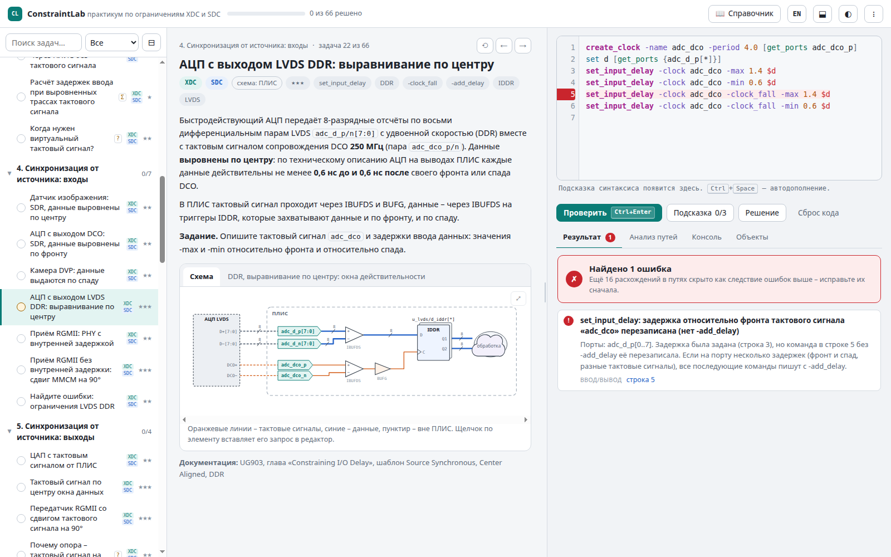

# ConstraintLab

**Интерактивный практикум по временны́м и физическим проектным ограничениям: XDC для Vivado и SDC для САПР ASIC.**

Каждая задача – реальный интерфейс или узел системы на кристалле со схемой и временны́ми диаграммами.
Вы записываете ограничения, а ConstraintLab проверяет их **по смыслу**: выполняет как сценарий Tcl,
строит модель тактовых сигналов и путей и сравнивает итоговые требования к предустановке и удержанию
с эталоном. Поэтому засчитывается любая эквивалентная запись (переменные, `expr`, другой порядок опций,
`-to [get_cells …]` вместо `-to [get_pins …/D]`), а сообщения об ошибках указывают на первопричину.

**Открыть онлайн: https://shchuchkin-pkims.github.io/ConstraintLab/?lang=ru** · [English version](README.md)



## Возможности

- **66 задач в 12 модулях** – от одной команды `create_clock` до интерфейсов DDR, передачи между
  тактовыми доменами, многотактных путей, режимов сканирования ASIC, стробирования тактового сигнала,
  разброса параметров на кристалле и MMMC.
- **В каждой задаче** – практический сценарий, схема (щелчок по элементу вставляет его запрос `get_ports` /
  `get_cells`), временны́е диаграммы, последовательные подсказки и подробный разбор: зачем нужно
  ограничение, что произойдёт при типичных ошибках и как проверить результат в Vivado или PrimeTime.
- **Проверка по смыслу.** Встроенный упрощённый статический временной анализ учитывает первичные,
  производные и виртуальные тактовые сигналы, их распространение, соотношения фронтов, задержки
  ввода/вывода (включая `-clock_fall` и `-add_delay`), ложные и многотактные пути (`-setup`/`-hold`,
  `-start`/`-end`), `set_max_delay -datapath_only`, группы тактовых сигналов и приоритеты исключений.
  Ошибки объясняются: частота вместо периода, тактовый сигнал не в той точке, забытый `-add_delay`,
  неверный знак `-min`, многотактный путь без пары `-hold` и многое другое.
- **Теги XDC и SDC** показывают, где применимо решение: только в Vivado, только в САПР ASIC или в обоих,
  если синтаксис общий. Чем отличаются XDC и SDC в конкретной задаче, сказано в конце разбора.
- **Консоль Tcl** с `report_clocks`, `report_clock_interaction`, `check_timing`, `report_timing`,
  `report_exceptions` и запросами объектов (`-hierarchical`, `-filter`, `-of_objects`).
- **Вкладка «Анализ путей»**: требование к каждому пути при ваших ограничениях и сравнение с эталоном,
  диаграммы фронтов запуска и захвата.
- **Справочник** команд с опциями и примерами и обзорные статьи.
- **Русский и английский** интерфейс (кнопка EN/RU вверху).
- **Работает без интернета** в любом современном браузере (Chrome, Edge, Firefox) в Windows, Linux и macOS,
  без установки и без зависимостей. Собирается в один HTML-файл.
- **Банк задач пополняется**: свои задачи – файлами JavaScript или во встроенном режиме автора.

## Запуск

- Открыть `index.html` в браузере (достаточно двойного щелчка).
- Или `./run.sh` (Linux, macOS) и `run.bat` (Windows) – ConstraintLab откроется в отдельном окне.
- Версия в одном файле: `python3 tools/build.py` создаёт `dist/constraintlab.html`.
- В интернете: https://shchuchkin-pkims.github.io/ConstraintLab/?lang=ru (GitHub Pages из корня репозитория).

Прогресс, ответы и настройки хранятся в браузере (localStorage); меню ⋮ сохраняет прогресс в файл
и загружает его на другом компьютере.

## Порядок изучения

Модули 1–9 построены на ПЛИС (Vivado), 10–12 – на САПР ASIC. Внутри модуля сложность растёт (★ – ★★★).

| № | Модуль | Чему учит |
|---|---|---|
| 1 | Тактовые сигналы: основы | `create_clock`, форма сигнала, дифференциальные входы, асинхронные генераторы, автоматически выводимые тактовые сигналы MMCM |
| 2 | Производные тактовые сигналы | делитель на регистре, мультиплексор BUFGMUX, две частоты на одном входе, расчёт соотношений фронтов |
| 3 | Системно-синхронный ввод/вывод | формулы задержек с учётом трасс платы, асинхронные входы, сквозные комбинационные пути, виртуальные тактовые сигналы |
| 4 | Синхронизация от источника: входы | SDR и DDR, выравнивание по центру и по фронту, данные по спаду, RGMII |
| 5 | Синхронизация от источника: выходы | вывод тактового сигнала через ODDR, инверсия, передатчик RGMII |
| 6 | Исключения | многотактные пути (N и N−1, `-start`/`-end`), ложные пути, синхронизатор сброса, приоритеты |
| 7 | Передача между тактовыми доменами | синхронизатор, код Грея (`set_max_delay -datapath_only`, `set_bus_skew`), ловушка XPM, связанные тактовые сигналы |
| 8 | Физические ограничения XDC | выводы, стандарты ввода/вывода, LVDS, IOB, параметры конфигурации, DRIVE и SLEW |
| 9 | Интерфейсы целиком и отладка | SPI, SDR SDRAM, поиск ошибок в XDC, чтение `check_timing` |
| 10 | SDC для ASIC: блок и тактовые сигналы | окружение блока, PLL и делители, режимы (`set_case_analysis`), виртуальные тактовые сигналы для бюджетов блока, до и после синтеза тактового дерева |
| 11 | SDC для ASIC: режимы, сканирование, стробирование | режим сдвига, программируемый делитель в объединённом режиме, ICG и `set_clock_gating_check`, `set_ideal_network`, режимы и углы |
| 12 | SDC для ASIC: иерархия и финальный анализ | бюджеты блока с `set_clock_latency -source`, правила проектирования, перекос, OCV и CRPR, MMMC |

## Как устроена проверка

1. Ваши ограничения выполняются как сценарий Tcl над списком соединений, который соответствует схеме задачи.
2. Анализ строит и распространяет тактовые сигналы, перечисляет пути и вычисляет требования
   к предустановке и удержанию по соотношениям фронтов, задержкам ввода/вывода и исключениям.
3. Результат сравнивается с таким же анализом эталона. Другой, но равноценный набор команд засчитывается;
   набор, который выглядит правильно, но меняет хотя бы одно требование, – нет.

Модель анализирует **идеальные** тактовые сигналы и не считает задержки ячеек и трассировки: проверяется
смысл ограничений, а не запас конкретной реализации. Окончательную проверку выполняют Vivado или PrimeTime
(`report_timing_summary`, `check_timing`, `report_exceptions`, `report_clock_interaction`).

## Как добавить задачу

Задачи – обычные файлы JavaScript в `bank/`, перечисленные в `bank/index.js`. Задача описывает сценарий
(Markdown), список соединений и схему (одним описанием), временны́е диаграммы, эталон, подсказки, разбор
и самопроверку, которую выполняет валидатор. Английские переводы задач лежат в `bank/en/`.

- Формат задач и модель анализа: [docs/bank-format.ru.md](docs/bank-format.ru.md)
  (по-английски: [docs/bank-format.md](docs/bank-format.md)).
- Правила оформления: [docs/authoring-guide.md](docs/authoring-guide.md), термины –
  [docs/terminology.md](docs/terminology.md).
- Попробовать новый файл без правки манифеста: `index.html?bank=my_tasks.js`.
- Или режим автора в меню ⋮: написать задачу в браузере, проверить её и сохранить файлом.

Инструменты (Node.js и Python 3, без дополнительных пакетов):

```
node tools/validate.js -v       # банк задач: эталоны проходят, самопроверки дают ожидаемый результат
node tools/test-engine.js       # регрессионные тесты движка анализа
node tools/i18n-check.js        # английский перевод: полнота и структура
node tools/dev/q.js 01_clocks.js clocks.primary 'create_clock -period 10 [get_ports sys_clk]' "report_clocks"
python3 tools/build.py          # сборка в один файл: dist/constraintlab.html
```

## Состав

```
index.html        приложение
css/app.css       стили (светлая и тёмная темы)
js/               интерпретатор Tcl, список соединений, команды XDC/SDC, временной анализ, проверка,
                  отчёты консоли, схемы и диаграммы, справочник, интерфейс
bank/             банк задач (русский); bank/en – английские переводы
docs/             формат задач, правила оформления, терминология
tools/            валидатор, тесты движка, проверка перевода, снимки экрана, сборка в один файл
```

## Автор

**Щучкин Евгений Юрьевич** (Evgenii Shchuchkin), GitHub: [shchuchkin-pkims](https://github.com/shchuchkin-pkims/)

## Лицензия

[MIT](LICENSE)
